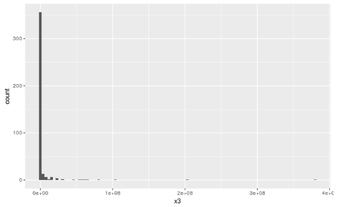
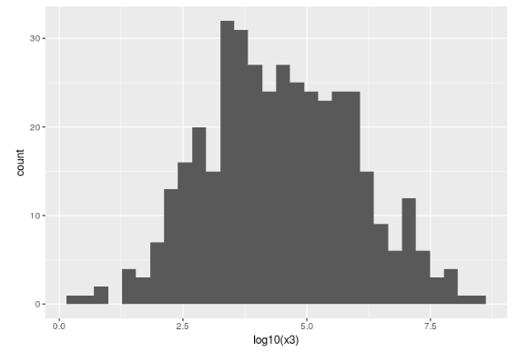

```{r, warning=F, message=FALSE}
library(dplyr)
library(ggplot2)
```

Vamos inicialmente importar os dados:

```{r, warning=FALSE, message=F}
attach(mtcars)
```

E ver a estrutura dos dados, bem como os mesmos se comportam:

```{r}
str(mtcars)
summary(mtcars)
```

Vamos verificar se existe alguma relação entre o peso do carro e a potência do mesmo:

```{r}
ggplot(mtcars, aes(x = wt, y = hp)) +
  geom_point() +
  geom_smooth(method = "lm")
```

Vemos que existe uma ligeira tendência entre o peso e a potência do carro, o que faz bastante sentido, visto que um carro mais pesado precisa de mais potência para se locomover. Como pode ser visto na correlação a baixo:

```{r}
cor(mtcars$hp, mtcars$wt)
```

Mas vemos que existem valores um pouco atípicos que atrapalham na correlação entre as variáveis, com isso, vamos aplicar a função log em ambas variáveis, com intuito de atenuar os valores extremos:

```{r}
ggplot(mtcars, aes(x = log(wt), y = log(hp))) +
  geom_point() +
  geom_smooth(method = "lm")
```

Com isso, podemos ver que a relação entre as variáveis aumentou, como pode ser visto também pela correlação:

```{r}
cor(log(wt), log(hp))
```

----

###Vendo de outra forma
 
Há duas razões para que transformações como esta sejam aplicadas aos dados: **uma estatística** e **uma proporcional**.
 
**A primeira**: Supondo que a distribuição da variável em questão possui um viés, ou seja, uma das extremidades elevadas e uma cauda longa, medidas como correlação ou regressão podem ser bastante influenciadas pelo pico da distribuição, outliers, dentre outros. A aplicação da transformação pode reduzir o efeito do viés.
 
**A segunda**: Alguns conceitos são melhor compreendidos quando tratamos sobre a proporção dos objetos do que sobre a diferença entre eles. 
Suponha duas empresas, Lindo Olhar e Burguer King, de portes pequeno e muito grande, respectivamente. Lindo Olhar possui um faturamento diário de alguns milhares de reais por dia, enquanto a segunda possui um faturamento de milhões de reais por dia. Se o faturamento da primeira empresa passa de R$ 3.000 para R$ 9.000 (uma diferença de 6 mil reais, razão de 3), é uma grande diferença visto que seu faturamento triplicou. Já se o faturamento da segunda passa de R$ 9.000.000 para R$ 9.006.000 (uma diferença 6 mil reais, razão de pouco mais de 1), [ninguém liga](https://oglobo.globo.com/cultura/kanye-west-da-dez-lojas-do-burger-king-de-presente-para-kim-kardashian-11991528), visto que a diferença foi baixa. Neste caso a transformação logarítmica nos dados de faturamento durante um ano, por exemplo, poderia ser utilizada para comparar o crescimento das empresas de forma justa - podendo ajudar a deixar a relação entre os dados mais clara.


No exemplo acima temos scatterplots do peso do cérebro do animal em função do peso do corpo. Dados brutos no gráfico 1 e com transformação log no gráfico 2. É difícil notar uma relação entre os dados no primeiro gráfico, enquanto no segundo podemos ver a relação entre eles claramente.

O mesmo ocorre para distribuições:



Podemos ver que a distribuições dos dados são bastante enviesadas à direita, mas ao transformarmos para o log na base 10 do valor original, temos uma distribuição bem mais normal:




*Referências* 

- http://onlinestatbook.com/2/transformations/log.html 

- http://fmwww.bc.edu/repec/bocode/t/transint.html 

- http://www-ist.massey.ac.nz/dstirlin/CAST/CAST/Hcurvature/curvature_c1.html 

- https://blog.majestic.com/case-studies/correlation-data-transformations/ 


