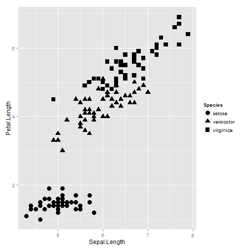
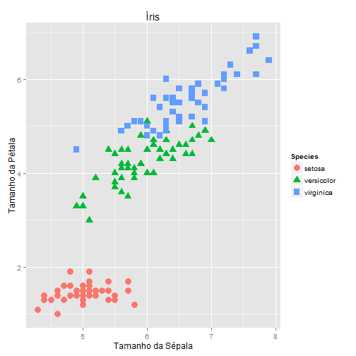

# Tutorial GGplot2
================================================================


**GGplot2** é um pacote de visualização de dados que pode ser utilizado junto à ferramenta R, neste tutorial mostraremos um pouco sobre a instalação e exemplos utilizando esta biblioteca.

Esta biblioteca é um conjunto de componentes independentes que podem ser utilizados de diferentes maneiras, construindo gráficos de maneira incremental. 

"A general scheme for data visualization which breaks up graphs into semantic components such as scales and layers. Ggplot2 can serve as a replacement for the base graphics in R and contains a number of defaults for web and print display of common scales".


## Instalação e Carregamento do pacote

A instalação e utilização da biblioteca no RStudio é feita da seguinte maneira, respectivamente (retire a #):


```r
#install.packages("ggplot2")

#library(ggplot2)
```


## Exemplo 1 - Criando o primeiro plot

Utilizaremos uma base de dados padrão do R, iris - para mais informações: help(iris).


```r
# Carrega a base de dados em mt
iris <- iris

# Breve sumário sobre os dados
summary(iris)
```

```
##   Sepal.Length    Sepal.Width     Petal.Length    Petal.Width          Species  
##  Min.   :4.300   Min.   :2.000   Min.   :1.000   Min.   :0.100   setosa    :50  
##  1st Qu.:5.100   1st Qu.:2.800   1st Qu.:1.600   1st Qu.:0.300   versicolor:50  
##  Median :5.800   Median :3.000   Median :4.350   Median :1.300   virginica :50  
##  Mean   :5.843   Mean   :3.057   Mean   :3.758   Mean   :1.199                  
##  3rd Qu.:6.400   3rd Qu.:3.300   3rd Qu.:5.100   3rd Qu.:1.800                  
##  Max.   :7.900   Max.   :4.400   Max.   :6.900   Max.   :2.500
```


Diferente de outras bibliotecas GGplot2 não é verborrágico e a geração dos gráficos utiliza o conceito de camadas. Podemos guardar gráficos em variáveis, adicionar outras camadas e, finalmente, plotar o gráfico. Então, simplesmente temos:


```r
# ggplot(data=iris ...) - Inicia o objeto ggplot e define a base de dados a ser usada naquele plot
# ggplot(data=iris, aes(x=Sepal.Length, y=Petal.Length, shape = Species)) - aes (Aesthetics) descreve como as variáveis dos dados são mapeadas para elementos visuais. 
# Neste caso o eixo x representará o Tamanho da Sépala (Sepal.Length), o eixo y o Tamanho da Pétala (Petal.Length) e a forma do ponto (shape) dependerá da Espécie (Specie) da flor.

a <- ggplot(data=iris, aes(x=Sepal.Length, y=Petal.Length, shape = Species)) 

# geom_point(...) espeficica o tipo de gráfico que estamos construindo, neste caso um gráfico de pontos ou gráfico de dispersão - scatterplot. Utilizando o operador '+' pode-se contruir o gráfico incrementalmente adicionando camadas ao objeto ggplot criado acima. 

a <- a + geom_point(size=4)

# Plot do gráfico
a
```

 

Como incremento do gráfico podemos também definir labels para os eixos, cores, titulo, dentre outras propriedades. 


```r
# ggplot(data=iris, aes(x=Sepal.Length, y=Petal.Length, shape = Species)) + geom_point(size=4, aes(colour=Species)) + xlab("Tamanho da Sépala") + ylab("Tamanho da Pétala") + ggtitle("Íris")

# ou 

ggplot(data=iris, aes(x=Sepal.Length, y=Petal.Length, shape = Species, col = Species)) + geom_point(size=4, aes(colour=Species)) + xlab("Tamanho da Sépala") + ylab("Tamanho da Pétala") + ggtitle("Íris")
```

 


xlab ylab ggtitle
bar chart
line chart  
stacked bar chart
histogram


Referencias:
* http://ggplot2.org/
* http://docs.ggplot2.org/current/ggplot.html
* http://docs.ggplot2.org/current/index.html
* http://en.wikipedia.org/wiki/Ggplot2
* Manual completo - http://cran.r-project.org/web/packages/ggplot2/ggplot2.pdf
* http://docs.ggplot2.org/0.9.3/aes.html
* **http://stackoverflow.com/questions/11657380/is-there-a-table-or-catalog-of-aesthetics-for-ggplot2**
* http://www.ling.upenn.edu/~joseff/avml2012/#Section_1.1
* http://blog.echen.me/2012/01/17/quick-introduction-to-ggplot2/
* 
